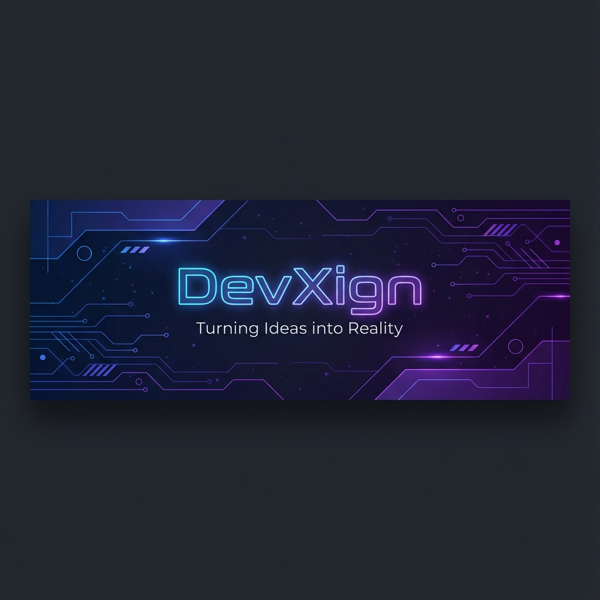

  

<h1 align="center">Hi there, I'm <a href="https://github.com/DevXign">DevXign</a> 👋</h1>

  

  <b>Passionate about creating beautiful, responsive, and functional web and mobile applications.</b> 
  I specialize in the MERN stack and React Native, focused on building intuitive and dynamic user experiences.

 

## 🛠️ Tech Stack

  

 

## 📊 GitHub Stats

  

 

## ⚡ Streak Stats

    

 

## 🤝 Connect With Me

  <!-- Update these links with your actual profile URLs -->
  
  
  

 

  

